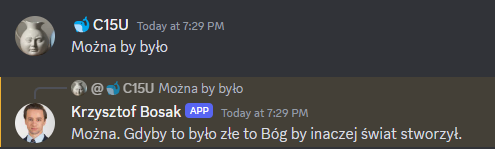

# Bot Krzysztofa Bosaka przepisany na GO


## Uruchamianie
W zmiennych środowiskowych zapisać do zmiennej `KRZYSZTOF_GOSAK_TOKEN` token bota Discorda, np.
```
export KRZYSZTOF_GOSAK_TOKEN=my_discord_bot_token
```

Uruchomić program (skompilować lub za pomocą `go run .`)
